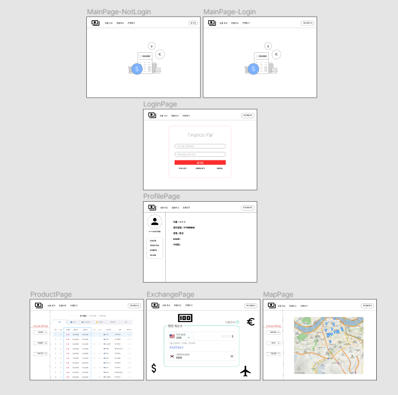

# FinancePal

1. 팀원 정보 및 업무 분담 내역
* 팀원
  * 이지원
  * 이수민

* 업무 분담
  * 프론트엔드와 백엔드로 구분하여 업무 분담
  * 프론트엔드는 스타일링을 제외하고 구현
  * CSS는 공통으로 분담

  * 지원: 프론트엔드
  * 수민: 백엔드

2. 설계내용 및 실제 구현 정도
  * 그라운드 룰 설정
    * 협업 시 깃 컨벤션에 맞춰 커밋 메시지를 작성하고 merge는 같이 내용을 확인하고 진행
  * 사이트 컨셉 설정
  * 파트 나누기
  * 필수 기능을 정리하고 필요한 데이터, 참고자료를 수집하고, 데이터 의존도, 작업 우선도를 판단하여 진행 순서를 정함
    1. 회원가입
    2. 예적금 금리 비교
    3. 환율 계산
    4. 게시판
    5. 은행 검색
    6. 상품 추천
  * 스타일링은 부트스트랩을 사용하기로 정하고, 페이지 기본 색상을 결정
  * 아래와 같이 화면을 구상

  
  * 구현 정도:
    - 명세에 나온 필수 기능들은 모두 구현
    - 처음의 목표로 한 것의 약 80% 구현

3. 데이터 베이스 모델링(ERD)

4. 금융 상품 추천 알고리즘에 대한 기술적 설명
  * 고객에 맞는 상품을 추천하기 위해 회원가입 시 회원의 생년월일, 급여, 소유금을 입력 받아 db에 저장한다.
  * 생년월일로 나이를 계산하고, 판다스를 이용하여 상품 가입자들의 평균나이, 평균 급여, 평균 소유금의 차이를 각각 가중치를 나누어 유사도 랭킹을 매기고, 기존 가입 상품을 제외한 적금 상품 5개, 예금 상품 5개를 추천한다.

5. 서비스 대표 기능들에 대한 설명
  * 상품 비교
    * 적금 예금 상품 목록을 출력하고 상품에 자세한 정보를 볼 수 있는 페이지를 구현
    * 상세 상품 페이지에서 상품을 가입할 수 있다.
    - 상품 데이터 저장 url로 요청을 보내면 금융감독원 Open API를 활용해 백엔드 서버의 데이터베이스에 금융 상품 데이터를 저장
    - 상품 데이터에 대한 정보를 요청하는 url로 요청을 보내면 데이터베이스에 저장된 금융 상품 데이터를 응답

  * 주위 은행 찾기
    * 카카오맵 API를 이용하여 주위 은행을 찾아 지도를 출력
    * 회원의 경우 회원가입시 입력한 주소를 바탕으로 초기 화면을 입력 주소로 출력

  * 환율 계산기
    * 환전 API데이터를 바탕으로 원화에서 외화로 바꿀때 가격을 계산
    - 환율 정보 저장 url로 요청을 보내면 한국수출입은행 API를 활용해 백엔드 서버의 데이터베이스에 실시간 환율 데이터를 저장
    - 사용자 편의를 위한 고려사항들 (1/10/100만원 단위의 금액 증가 버튼, 천 단위 콤마)

  * 게시판
    * 게시판을 자유게시판, qna게시판, 공지사항으로 나누어 구현
    * 게시판은 회원만 글쓰기, 댓글쓰기가 가능하며, 공지사항은 관리자만 글쓰기 가능

  * 프로필 페이지
    * 프로필 페이지는 개인 프로필, 포트폴리오, 추천 상품으로 나누어져 있다.
    * 개인 프로필은 다른 사용자도 볼 수 있으며, 닉네임, 작성 글, 작성 댓글을 확인 가능
    * 포트폴리오는 자신의 급여, 소유금, 가입 상품을 확인 가능하며 가입 상품의 이자를 그래프로 확인 가능하다.
    * 추천 상품은 위의 상품 추천 알고리즘의 결과를 출력해 준다.

6. 후기
* 지원
  - 일주일이라는 시간이 너무 짧게 느껴졌다.
  - 함께 열심히 해준 조원에게 너무 감사하다.
  - 조금 더 좋은 결과물을 얻지 못해 아쉽다.

* 수민
  - 뛰어난 동료에게서 많이 배웠다.
  - 개발 프로세스를 더 경험해보고 멋있는 웹앱을 만들고 싶다.
  - 생각보다 재밌었다.